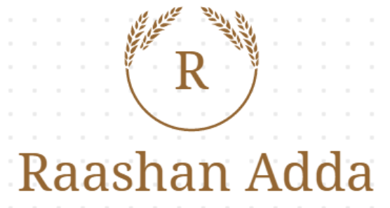

<h1 align="center">Rashan Adda</h1>

<h3>The art of teaching is the art of Assisting Discovery </h3>

## Introduction:
<b>Rashan Adda</b>  
Problem : Inspite of employing large chunk of country's population , the local vendors face problems of eviction , irregular and insecure income , their products are not completely sold and are wasted and because its not legal they are prone to harrassment by various law enforcement agencies.   
Solution : Revolutionising consumption and selling of local products by changing the way customers and local vendors interact , we are desiging a platform where we would be warehousing products of these vendors and sell them as a whole and revenue would be distributed according to the supply they provide.As we will be having dynamic prices according to demands and reviews , it will boost sales of all products and will assure decent bussiness of all vendors.

## Table of Contents:

1) [Technology Stack](#depend)
2) [Feedback](#feed)
3) [Contribute](#contri)

## Technology Stack:
  1) JavaScript
  2) HTML5
  3) Django
  4) Sqlite3
  5) CSS
  6) EJS
  

## Feedback:
Feel free to file an issue if you come across any bugs

## Contribute:
* Feel free to report issues and bugs. It will be helpful for future lauches of the application
* All suggestions are welcome
* Fork repository and contribute

## Contributors:

* [Parag Kumar Gupta](https://github.com/paraggupta027)
* [Shobhit Agarwal](https://github.com/shobhit2002)
* [Taru Gupta](https://github.com/taru2001)
* [Yaggya Garg](https://github.com/yaggya01)

### Made at:

Logo generated by <a href="https://www.logomaker.com/" title="Free Online Logo Maker">LogoMaker</a>

<h6>BUILD IN PROGRESS :-)<h6>
